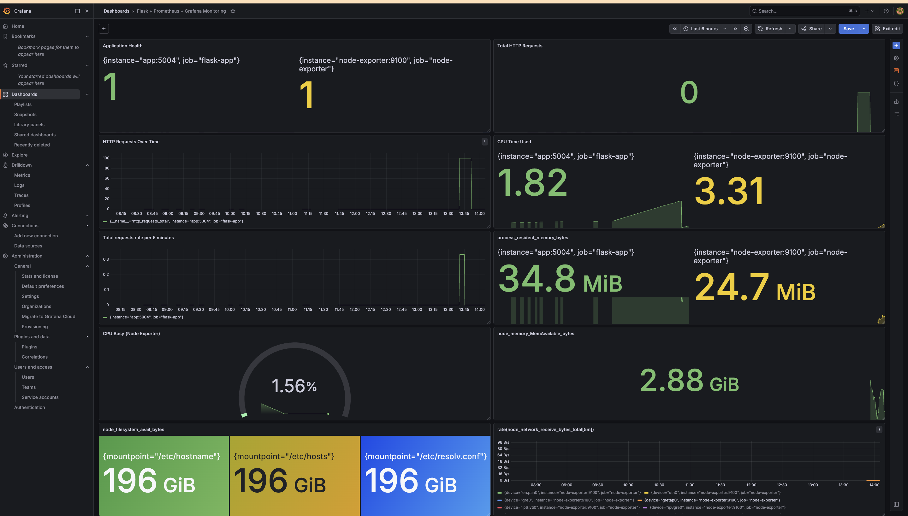

# 🚀 Dockerized DevOps Monitoring Stack

A production-style monitoring stack built with **Docker Compose**, **Flask**, **Prometheus**, **Grafana**, and **Node Exporter**. This project demonstrates how to containerize an application, collect metrics, visualize them with Grafana, and monitor both application-level and system-level performance.

---

## 📖 Project Overview

This project deploys a complete monitoring environment using Docker Compose. A Flask application exposes Prometheus metrics, Prometheus scrapes those metrics at regular intervals, Grafana visualizes them through dashboards, and Node Exporter provides host-level system metrics such as CPU, memory, disk, and network usage.

The project demonstrates real-world DevOps concepts including container orchestration, service discovery, persistent storage, infrastructure monitoring, and observability.

---

# 🏗 Architecture

```
                      Browser
                        │
        ┌───────────────┴───────────────┐
        │                               │
        ▼                               ▼
  Grafana (3000)                 Prometheus (9090)
        │                               ▲
        │                               │
        └───────────────┬───────────────┘
                        │
          ┌─────────────┴─────────────┐
          │                           │
          ▼                           ▼
 Flask App (5004)             Node Exporter (9100)
     /metrics                  System Metrics
```

---

# 📂 Project Structure

```
docker-monitoring-stack/
│
├── app/
│   ├── app.py
│   ├── Dockerfile
│   └── requirements.txt
│
├── prometheus/
│   └── prometheus.yml
│
├── grafana/
│   ├── dashboards/
│   │   └── flask-dashboard.json
│   │
│   └── provisioning/
│       ├── dashboards/
│       │   └── dashboard.yml
│       │
│       └── datasources/
│           └── datasource.yml
│
├── screenshots/
│   ├── architecture.png
│   ├── docker-containers.png
│   ├── docker-network.png
│   ├── grafana-dashboard.png
│   ├── prometheus-query.png
│   └── prometheus-targets.png
│
├── docker-compose.yml
├── .gitignore
└── README.md
```

---

# ✨ Features

* Dockerized Flask application
* Multi-container architecture using Docker Compose
* Prometheus metrics scraping
* Grafana dashboards
* Node Exporter system monitoring
* Custom Docker bridge network
* Docker service discovery
* Named volumes for persistent storage
* Grafana auto-provisioning
* Prometheus configuration via YAML
* Production-style monitoring stack

---

# 🛠 Technologies Used

* Docker
* Docker Compose
* Python
* Flask
* Prometheus
* Grafana
* Node Exporter
* PromQL
* Git
* GitHub

---

# 📊 Metrics Collected

## Flask Metrics

* HTTP Requests
* Request Rate
* Process CPU Time
* Process Memory Usage
* Application Health

## System Metrics (Node Exporter)

* CPU Usage
* Available Memory
* Disk Space
* Network Traffic
* Host Health

---

# 🚀 Getting Started

## Clone Repository

```bash
git clone https://github.com/ayushbishtcode/docker-monitoring-stack.git

cd docker-monitoring-stack
```

---

## Start the Stack

```bash
docker compose up -d
```

---

## Verify Running Containers

```bash
docker ps
```

---

## Access Services

| Service       | URL                           |
| ------------- | ----------------------------- |
| Flask App     | http://localhost:5010         |
| Prometheus    | http://localhost:9090         |
| Grafana       | http://localhost:3000         |
| Node Exporter | http://localhost:9100/metrics |

---

# 📈 Prometheus Targets

Navigate to:

```
http://localhost:9090/targets
```

Expected Targets:

* Flask App (UP)
* Node Exporter (UP)

---

# 📊 Grafana Dashboard

The dashboard includes:

* Application Health
* Total HTTP Requests
* HTTP Requests Over Time
* Requests Per Second
* CPU Time Used
* Python Memory Usage
* CPU Busy
* Available Memory
* Disk Availability
* Network Receive Rate

---

# 📷 Screenshots

## Grafana Dashboard

```

```

---

## Prometheus Targets

```
screenshots/prometheus-targets.png
```

---

## Docker Containers

```
screenshots/docker-containers.png
```

---

## Docker Network

```
screenshots/docker-network.png
```

---

# 🔍 PromQL Queries Used

### Application Health

```promql
up{job="flask-app"}
```

### Total Requests

```promql
http_requests_total
```

### Requests Per Second

```promql
sum(rate(http_requests_total[5m]))
```

### CPU Usage

```promql
100 - (avg by(instance)(rate(node_cpu_seconds_total{mode="idle"}[5m])) * 100)
```

### Available Memory

```promql
node_memory_MemAvailable_bytes
```

### Disk Availability

```promql
node_filesystem_avail_bytes
```

---

# 📚 DevOps Concepts Demonstrated

* Docker Images
* Docker Containers
* Docker Compose
* Container Networking
* Service Discovery
* Named Volumes
* Bind Mounts
* Infrastructure Monitoring
* Application Monitoring
* Metrics Collection
* Prometheus Scraping
* PromQL
* Grafana Dashboards
* Observability
* Infrastructure as Code (Configuration)

---

# 🎯 Learning Outcomes

Through this project I learned:

* Containerizing Python applications
* Managing multi-container environments
* Docker networking fundamentals
* Prometheus metrics collection
* Writing PromQL queries
* Grafana dashboard creation
* Monitoring application and infrastructure metrics
* Persistent storage using Docker volumes
* Grafana provisioning
* Production-style observability practices

---

# 🔮 Future Improvements

* Kubernetes Deployment
* Alertmanager Integration
* Grafana Alerting
* Loki Log Aggregation
* Tempo Distributed Tracing
* CI/CD using GitHub Actions
* Deployment to AWS
* Terraform Infrastructure
* SSL & Reverse Proxy with Nginx

---

# 📄 License

This project is licensed under the MIT License.

---

# 👨‍💻 Author

**Ayush Bisht**

GitHub: https://github.com/ayushbishtcode

---

⭐ If you found this project useful, consider giving it a star!
